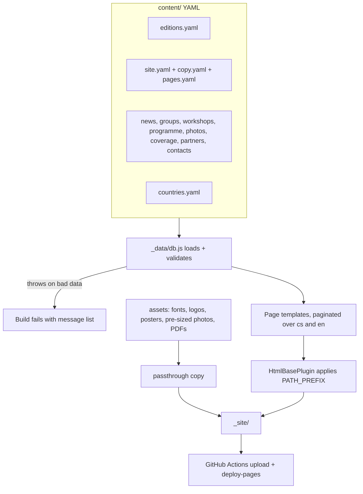
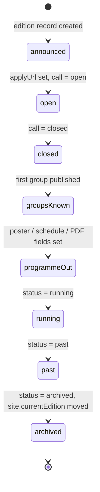
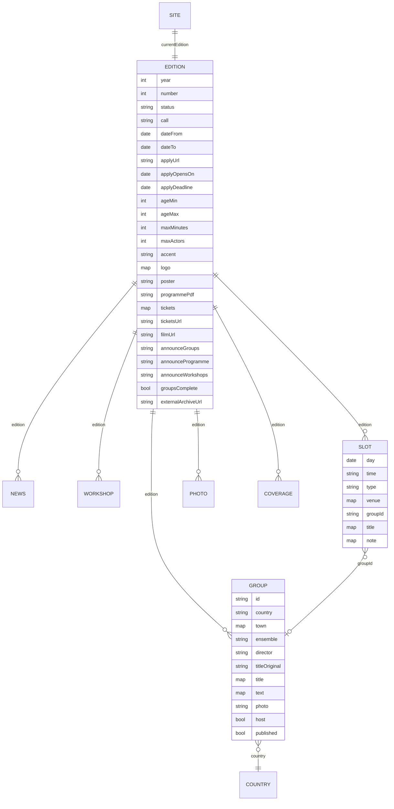

# feat: Build the Soukání Ostrov 2027 festival website

## Summary

Build the festival's first own website as an Eleventy 3 static site deployed to GitHub Pages from Jonáš's GitHub account. All copy and records live in YAML data files with Czech/English pairs and an edition tag; one edition record drives dates, conditions, colour, logo, poster and every "coming soon" state; a validation step fails the build on bad data. Czech pages sit at the root, English under `/en/`, and a footer-linked archive section makes archiving 2027 in 2029 a one-line change.

---

## Problem Frame

Soukání Ostrov has never had a festival site. Each edition lived inside the HOP-HOP ensemble site on a 2008 CMS that is unusable on phones and lands foreign groups on the wrong homepage. A Claude Design draft fixed the visual direction but carries invented content. The 16th edition (5.–9. 5. 2027) needs a bilingual site live in autumn 2026, before the application deadline at the end of December 2026, while most 2027 content is still unknown. The site is maintained by one editor in the repository, with no CMS (see origin: docs/brainstorms/2026-09-14-soukani-2027-website-requirements.md).

---

## Requirements

Origin requirements R1–R38 are carried forward with their original IDs; short forms below, full text in the origin. R39–R54 are added by this plan from flow analysis, research and review.

**Identity and visual design**

- R1. Cream background, ink text, one edition accent; no per-page hero colours.
- R2. Accent and logo defined once; the 2027 identity replaces the provisional orange and 2025 logo in a single change.
- R3. Landing hero keeps the animated concentric rings, orbiting dots and one small spider, logo in the centre.
- R4. Typography, circles and pill buttons follow the design's tone; free font only, no paid asset.
- R5. Responsive, readable on phones, no horizontal scrolling.

**Structure and navigation**

- R6. Menu order Úvod, O festivalu, Soubory, Program, Dílny, Fotogalerie, Pro média plus language switch; EN labels Home, About, Groups, Programme, Workshops, Photos, Press.
- R7. Every page exists in CZ and EN; the switch keeps the visitor on the same page.
- R8. Footer holds organizer identity with IČO, four contact roles, Facebook link, old-site archive link, partner logos.
- R9. Partners appear only in the footer.

**Landing page**

- R10. Hero states name, "16. mezinárodní divadelní festival dětí a mládeže", 5.–9. 5. 2027, Ostrov, and a state-dependent call-to-action.
- R11. Facts strip: dates, 16th edition, since 1995, actors 14–18, up to 50 min; age range easy to change.
- R12. Dated news items newest first with title, short text, link; launch items are the call and the announcement.
- R13. Short paragraph on the 2027 highlight (South Korean company, joint HOP-HOP production).

**About and call for applications**

- R14. Festival description per the 2027 brief (selection by artistic committee, seminars, discussions, side programme, Ostrov schools, "Než půjdeme do divadla").
- R15. Origin of the name (the spider who "soukal" friends together, Brixen, ~1995) and participating countries.
- R16. Venues: KKC Ostrov for performances, ZUŠ Ostrov for seminars, the town for the side programme.
- R17. No invented milestones, quotes or lecturer affiliations.
- R18. Conditions section: ages 14–18, up to 50 min, max 10 actors plus 2–3 adults plus driver, board and lodging for 10 + 3, early arrival possible, deadline end of December 2026, online form plus video.
- R19. Apply link is either a real URL or replaced by opening-date text; never empty.

**Groups, Programme, Workshops**

- R20. Before groups are known the page says the committee announces the selection after the deadline and names the month.
- R21. Group entry: country, town, ensemble, director, production title, CZ and EN text, optional photo.
- R22. Programme shows the current poster or a labelled placeholder, never the 2025 poster as current.
- R23. Schedule grouped by day: time, venue, ensemble, country, title, one-line annotation.
- R24. Programme PDF link and ticket information appear once they exist; before that, the publication month.
- R25. Seminars: directors' analysis seminar and seven actor seminars, each with title, lecturer, bio, description in both languages.
- R26. Before lecturers are confirmed the page explains the format and the publication month.

**Photos and Press**

- R27. Launch gallery: a few 2025 photos, the 2025 film link, old-site galleries per year, note that 2027 photos arrive during the festival.
- R28. Photos stored per edition.
- R29. Press downloads: logo variants (colour, white, negative), current poster, programme PDF when ready.
- R30. Media contact Irena Konývková with school email and phone.
- R31. Real coverage links only.
- R32. Four contact roles with zusostrov.cz emails and phones.

**Content lifecycle and operations**

- R33. All visitor-facing text is CZ/EN pairs in data files; layouts carry no festival copy.
- R34. News, groups, workshops, programme slots and photos are edition-tagged records.
- R35. Builds and deploys on push to the default branch.
- R36. Works at the github.io URL and at the final domain; the repo documents the DNS records the admin needs.
- R37. No cookies, trackers, analytics or third-party requests; embeds are plain links.
- R38. Footer logos: ZUŠ Ostrov, Město Ostrov, KKC Ostrov; other partners only when confirmed.

**Added by this plan**

- R39. One edition record per edition holds number, ISO dates, status, call state, apply URL and dates, age range, length and group-size limits, accent, logo variants, poster, programme PDF, tickets, film link, announcement months as `YYYY-MM` values (nullable), a `groupsComplete` flag and external archive URL; pages read these values rather than repeating them.
- R40. Page state follows editor-set flags in the edition record, never the build-time clock.
- R41. The build fails with a readable message on: a missing CZ or EN value in a required pair, an unknown edition tag, a missing referenced image or file, a photo file over the size limit or with an extension other than jpg, jpeg, png or webp, an unknown country code, an invalid date, a slot `groupId` that does not match a published group of the same edition, a news `page` key absent from the page registry, a `call: open` edition without `applyUrl`, or zero or more than one current edition.
- R42. Czech pages at the root, English under `/en/` with English slugs; no automatic language redirect; `hreflang` pairs plus `x-default` pointing to the English page, the fallback for visitors matching neither language.
- R43. A bilingual 404 page links to both homepages.
- R44. Every page has per-language title, description, `lang` attribute, canonical URL and an Open Graph image derived from the current poster or logo.
- R45. Country names come from a code table with CZ and EN names; dates are stored as ISO values and formatted per language.
- R46. Records carry a `published` flag; unpublished records are excluded from the build.
- R47. Geist is self-hosted as woff2 files; no font requests leave the site.
- R48. The hero animation is CSS-only and honours `prefers-reduced-motion`.
- R49. Gallery photos are committed pre-sized (long edge at most 1600 px, file at most 400 KB) and copied as-is; the validator rejects oversized files and the README documents how to resize on a Mac or phone.
- R50. An archive section lists all editions; archived editions with local records render their own pages in their own accent, earlier editions link to the old site.
- R51. The base path and absolute site URL are two build variables; switching to the custom domain changes them and nothing in the templates.
- R52. A README explains every editor task: add news, add a group, add photos, swap identity, flip a state, archive an edition, and connect the domain.
- R53. Machine-readable discovery, in two steps: `sitemap.xml` and `robots.txt` generated from the page registry and the archive pages with all crawlers allowed (built with routing in U3); JSON-LD `Event` and `Organization` structured data derived from the current edition and organizer records, and an `llms.txt` summary built from the copy file (built with launch content in U10, once the address, IČO and copy are final); no value is typed twice.
- R54. While the site is served from the github.io project URL, every page carries `<meta name="robots" content="noindex">` so the temporary address never enters search results; the tag is derived from the `SITE_URL` host and disappears on its own once the site URL is `soukani.cz`.

---

## Key Technical Decisions

- **Eleventy 3.1.6 with Nunjucks templates, ESM config, Node 22.** Chosen over Astro 7 and Hugo for the two-year idle cycle: Eleventy 3 has been stable since 2024 with no breaking release, the stack is plain JS plus YAML, and the bundled `HtmlBasePlugin` rewrites every root-relative link and asset URL in HTML output for the github.io path prefix without touching templates (it does not process CSS files, so `url()` references inside stylesheets are written relative to the stylesheet). Astro's typed schemas and native root-Czech routing were the runner-up; its yearly breaking majors and manual base-path prefixing tipped the balance. Hugo would need Go templates and offers no data validation story.
- **No i18n plugin; a page registry drives languages.** Eleventy's bundled I18n plugin assumes both languages under a prefix, which conflicts with Czech at the root. Instead each page template paginates over `["cs", "en"]`, reads its slugs and labels from a pages registry, and builds its own counterpart link. This is about twenty lines and has no hidden behaviour.
- **One data entry point that validates.** A single JS global data module loads every YAML file under `content/`, validates it, and exposes `db.current`, `db.editions`, `db.news`, and so on. Validation throwing inside global data is the one place Eleventy guarantees to run on every build, local or CI. Plain YAML files stay editor-friendly; the validator is hand-written against a small field list, no schema library needed.
- **The edition record is the single source of edition facts.** Facts strip, hero, call conditions, programme placeholders, press labels and archive pages all read the current edition. This removes the drift the flow analysis found between the facts strip and the call conditions, and makes the 2029 rollover a data change.
- **State by flags, not by date.** A static site rebuilds only on push, so "form opens on", "deadline passed" and "festival over" are `call` and `status` values the editor flips. Dates are still stored so texts can print them.
- **Localized slugs from the registry.** `/o-festivalu/` pairs with `/en/about/`, `/program/` with `/en/programme/`. English visitors arriving from AITA/IATA get English URLs; the registry makes the counterpart lookup exact rather than a string replacement.
- **Archive built now.** Templates take an edition parameter, so `/archiv/2027/` is the same partials rendered for an archived edition. Building it now makes the acceptance example for archiving testable before 2029 and costs one list page and one detail page.
- **Base path and site URL from environment variables.** `PATH_PREFIX` and `SITE_URL` are repository variables read by the workflow and the config; `SITE_URL` is the bare origin and absolute URLs are composed as origin plus prefix plus path. Under GitHub Actions publishing the `CNAME` file is ignored; the custom domain is set in repository settings, so the README documents DNS records and the two-variable switch instead of a CNAME file.
- **No build-time image pipeline.** Photos are committed pre-sized and passthrough-copied. `@11ty/eleventy-img` was considered and dropped: it brings the native `sharp` binary, the main dependency-rot risk across the two-year idle gap, to optimise a gallery of a few dozen photos. The validator's size limit replaces it as the guard. There is no thumbnail set: the grid and the full view use the same committed file, so a gallery of several dozen photos costs a phone visitor a noticeable download. This is accepted; a visitor who opens the gallery expects to load photos, and producing two files per photo is editor time the festival does not have. Node 22 LTS remains the pinned runtime.
- **Tests with the Node test runner against a programmatic build.** Eleventy's programmatic API renders the site to JSON without writing files, so build-output assertions (counterpart links, hreflang, no empty hrefs, no placeholder text) run as ordinary tests with no extra dependencies. State-variant scenarios swap content by pointing `db.js` at a fixture directory through the `CONTENT_DIR` variable, one fixture set per test file, because the Node runner isolates files into processes and Eleventy imports the data module once per process. Because one process holds one fixture, state-dependent assertions are grouped by fixture, not by page: each `test/fixtures/<scenario>/` (seed, call-open, call-closed, past, null-dates, groups-partial, groups-complete, programme-out, rollover-2029) pairs with a `test/state-<scenario>.test.js` that builds once and asserts the home, call, list, media and archive expectations for that state; the per-unit files (`test/home.test.js`, `test/call.test.js`, `test/lists.test.js`, `test/media.test.js`) hold only fixture-independent assertions, and the scenarios listed under each unit below name the state they belong to. For the same reason `eleventy.config.js` and `build.js` read `PATH_PREFIX` and `SITE_URL` inside their exported functions, not at module top level, so `test/config.test.js` can vary them per Eleventy instance.
- **Brief facts override design content.** Every string comes from the 2027 brief and the 2025 archive; the design draft is consulted only for geometry, rhythm and the hero animation (see origin Key Decisions).

---

## High-Level Technical Design

### Build pipeline



### Edition lifecycle



`status` (upcoming, running, past, archived) and `call` (announced, open, closed) are independent flags; `groupsKnown` and `programmeOut` are derived from record presence, not flags.

### Page × state matrix

| Page / element | call announced | call open | call closed | groups known | programme out | running | past | archived, new edition empty |
|---|---|---|---|---|---|---|---|---|
| Hero CTA | conditions (About) | apply URL | Groups page | Groups page | Programme | Programme | Photos | conditions link when known, otherwise no CTA |
| Hero dates | dates or "termín upřesníme" | dates | dates | dates | dates | dates | "proběhl" + dates | new edition, "termín upřesníme" |
| Facts strip | known facts only | same | same | same | same | same | same | number + "since 1995" only |
| News | list, newest first; section hidden when the current edition has no published items | same | same | same | same | same | same | hidden until the new edition has news |
| Call section | conditions + "form opens" text | conditions + button | conditions + "closed, applicants notified" | same | same | hidden | hidden | conditions when known |
| Groups | "selection announced in <month>" | same | same | list + "more to come" until complete | list | list | list | "selection announced in <month>" |
| Programme | "published in <month>", poster placeholder | same | same | same | poster + schedule + PDF/tickets when set | same | same | placeholder texts |
| Workshops | format + "published in <month>" | same | same | same or partial list | list | list | list | format text |
| Photos | previous-edition teaser + old-site links | same | same | same | same | current photos as they arrive | current photos + film link | previous edition becomes the teaser |
| Press | logos labelled by edition, poster when set | same | same | same | poster + PDF | same | same | new labels |

### Data model



Every `map` field is a `{cs, en}` pair; `announce*` fields are nullable `YYYY-MM` strings formatted per language. Directional guidance for the implementer, not a schema to copy verbatim.

---

## Output Structure

```text
soukani/
├── .github/workflows/deploy.yml
├── .nvmrc
├── eleventy.config.js
├── package.json
├── README.md                     # editor guide + domain checklist
├── content/                      # editor-facing data
│   ├── site.yaml                 # currentEdition, organizer, social, facebook
│   ├── copy.yaml                 # UI strings and page copy, cs/en pairs
│   ├── pages.yaml                # page registry: key, slug.cs/en, label.cs/en
│   ├── editions.yaml
│   ├── countries.yaml
│   ├── contacts.yaml
│   ├── partners.yaml
│   ├── news.yaml
│   ├── groups.yaml
│   ├── workshops.yaml
│   ├── programme.yaml
│   ├── photos.yaml
│   └── coverage.yaml
├── src/
│   ├── _data/db.js               # loads content/, validates, exposes db
│   ├── _data/build.js            # SITE_URL, PATH_PREFIX, build metadata
│   ├── _includes/layouts/base.njk
│   ├── _includes/partials/       # header, footer, hero, news-list, group-card, schedule, ...
│   ├── pages/                    # one template per page, paginated over languages
│   ├── archive/                  # archive list + edition page templates
│   ├── 404.njk
│   ├── assets/css/
│   ├── assets/fonts/             # Geist woff2 + OFL licence
│   ├── assets/identity/2025/ 2027/   # logo variants per edition
│   ├── assets/posters/
│   ├── assets/photos/2025/ 2027/
│   ├── assets/partners/
│   └── assets/downloads/         # programme PDFs
├── lib/                          # validator, filters, url helpers (plain JS, tested)
└── test/                         # node --test files
```

---

## Implementation Units

### Phase A — Foundation

### U1. Repository, Eleventy skeleton and GitHub Pages deploy

- **Goal:** A git repository on Jonáš's GitHub account that builds a two-language placeholder page with Eleventy and deploys it to GitHub Pages on every push to `main`, at the project-page URL, with the base path and site URL controlled by two variables.
- **Requirements:** R35, R36, R51, R43 (page shell only).
- **Dependencies:** none.
- **Files:** `package.json`, `.nvmrc`, `.gitignore`, `eleventy.config.js`, `.github/workflows/deploy.yml`, `src/_data/build.js`, `src/pages/index.njk` (placeholder), `src/404.njk` (placeholder), `test/config.test.js`.
- **Approach:** `git init`, create the repo with `gh repo create` under the user's account, set Pages source to GitHub Actions, and create the repository variables `PATH_PREFIX=/<repo>/` and `SITE_URL=https://<user>.github.io` with `gh variable set` before the first push. ESM config with `HtmlBasePlugin`, `pathPrefix` from `PATH_PREFIX` (default `/`), passthrough for `src/assets`, a watch target on `./content/` so local serve rebuilds on data edits, an empty `.nojekyll` in output. Workflow: checkout, Node 22 with npm cache, `npm ci`, build with `PATH_PREFIX` and `SITE_URL` from repository variables, `upload-pages-artifact`, `deploy-pages`, `workflow_dispatch` for manual rebuilds, and a `concurrency` group `pages` with `cancel-in-progress: false`, matching GitHub's Pages starter workflow, so an active deploy is never cancelled and only the newest queued run waits. Pin action major versions. `build.js` (named to avoid clashing with the content `site` data) reads the environment inside its exported function and exposes `url` (bare origin), `pathPrefix`, `absoluteUrl(path)` composing origin plus prefix plus path, and `time`.
- **Patterns to follow:** the Eleventy base blog's `eleventy.config.js` and `gh-pages.yml.sample` (see Sources).
- **Test scenarios:**
  - Happy path: config module loads under Node 22 and reports `pathPrefix` `/` when `PATH_PREFIX` is unset.
  - Happy path: with `PATH_PREFIX=/soukani/`, a rendered link `href="/en/"` becomes `/soukani/en/` in output.
  - Edge: `SITE_URL` with and without trailing slash yields one canonical form; `absoluteUrl("/en/")` with prefix `/soukani/` gives `https://<user>.github.io/soukani/en/`.
  - Happy path: editing a file under `content/` during local serve triggers a rebuild (manual check once).
  - Integration: the Actions run on push to `main` publishes the placeholder at the github.io URL (manual check once).
- **Verification:** the github.io project URL serves the placeholder in both languages with correctly prefixed assets; a manual `workflow_dispatch` rebuild succeeds; `npm test` passes.

### U2. Content data model and build-time validation

- **Goal:** All editor-facing content lives in `content/*.yaml`, loaded through one validated `db` global, with the edition record, page registry and record collections defined and seeded with 2025 (archived, external archive URL) and 2027 (upcoming) editions.
- **Requirements:** R33, R34, R39, R40, R41, R45, R46, R2, R11, R21, R23, R25, R28.
- **Dependencies:** U1.
- **Files:** `content/site.yaml`, `content/editions.yaml`, `content/pages.yaml`, `content/copy.yaml`, `content/countries.yaml`, `content/contacts.yaml`, `content/partners.yaml`, `content/news.yaml`, `content/groups.yaml`, `content/workshops.yaml`, `content/programme.yaml`, `content/photos.yaml`, `content/coverage.yaml`, `src/_data/db.js`, `lib/validate.js`, `lib/dates.js`, `test/validate.test.js`, `test/db.test.js`.
- **Approach:** `db.js` reads every YAML file under the directory named by `CONTENT_DIR` (default `content/`) with the `yaml` package, runs `lib/validate.js`, and throws one Error listing all problems with file, record id and field. Exposes `db.site`, `db.languages` (`["cs", "en"]`), `db.current` (the edition matched by `db.site.currentEdition`), `db.editions` sorted by year descending, `db.archivePages` (archived editions without `externalArchiveUrl` crossed with languages, for U9 pagination), and per-collection arrays filtered to `published !== false`. Derived helpers: `db.forEdition(collection, year)`, `db.state(edition)` returning the matrix state. Required pairs must have non-empty `cs` and `en`, listed per collection: groups `town`, `title`, `text`; slots `venue`, `title`, `note`; workshops `title`, `description`, `bio`; pages `slug`, `label`; every leaf pair in `copy.yaml`; photo captions are optional pairs. Countries are ISO codes; dates ISO strings; `announce*` values `YYYY-MM` or null; `groupsComplete` boolean; `edition` values must match an existing edition year; a slot `groupId` must match a published group of the same edition; a news `page` key must exist in the registry; photo files must exist, be at most 400 KB and have a jpg, jpeg, png or webp extension. Exactly one edition must equal `currentEdition` and it must not be `archived`. An edition with `call: open` must have a non-empty `applyUrl`, so `db.state` derives `open` from the flag alone. Test fixtures live under `test/fixtures/<scenario>/` and each test file sets `CONTENT_DIR` once.
- **Execution note:** Implement the validator test-first; its error messages are the editor's only safety net.
- **Patterns to follow:** Eleventy global data from a JS module; Eleventy's documented `addDataExtension` is not used because loading goes through `db.js`.
- **Test scenarios:**
  - Happy path: valid seed data loads; `db.current.year` is 2027; `db.forEdition("groups", 2027)` is empty; `db.editions[0].year` is 2027.
  - Error: group with `text.en` missing fails with a message naming `groups.yaml`, the group id and `text.en`.
  - Error: news item with `edition: 2072` fails naming the unknown edition.
  - Error: group with `country: "XY"` fails naming the unknown code.
  - Error: slot with `day: "5.5.2027"` fails as invalid ISO date.
  - Error: two editions marked current, or `currentEdition` pointing at an archived edition, fails.
  - Error: photo whose `file` does not exist on disk fails naming the path; a photo over 400 KB fails naming the size; a photo with a `.heic` file fails naming the allowed formats.
  - Error: a `pages.yaml` entry missing `slug.en` fails naming the page key and field.
  - Error: edition with `call: open` and no `applyUrl` fails naming the field.
  - Error: slot with `groupId: "italy-brixn"` (typo) or pointing at an unpublished group fails naming the slot and id.
  - Error: news item with `page: programm` fails naming the unknown page key.
  - Error: edition with `announceGroups: "February 2027"` fails as not `YYYY-MM`.
  - Edge: record with `published: false` is absent from `db` collections but does not fail validation.
  - Happy path: with `CONTENT_DIR` pointing at `test/fixtures/call-open/`, `db.current.call` is `open` and the real `content/` files are not read.
  - Edge: edition with `dateFrom` null is valid when `status` is `upcoming` (new-edition-empty state).
  - Edge: `lib/dates.js` formats `2027-05-05`/`2027-05-09` as `5.–9. 5. 2027` for cs and `5–9 May 2027` for en; same-month and cross-month ranges.
  - Happy path: `db.state(edition)` returns `open` when `call: open`; `groupsKnown` once one published group exists; `past` when `status: past`.
- **Verification:** `npx @11ty/eleventy` succeeds on seed data; deliberately breaking a field fails the build with a message an editor can act on; all validator tests pass.

### U3. Bilingual layout shell, routing and language switch

- **Goal:** Every page template renders a Czech page at its Czech slug and an English page under `/en/` at its English slug, shares a base layout with header menu, language switch, footer and per-language metadata, the 404 page is bilingual, and the site emits `sitemap.xml` and `robots.txt` from the page registry.
- **Requirements:** R6, R7, R8, R9, R32, R38, R42, R43, R44, R53 (sitemap and robots), R54, R33; AE1.
- **Dependencies:** U2.
- **Files:** `src/_includes/layouts/base.njk`, `src/_includes/partials/header.njk`, `src/_includes/partials/footer.njk`, `src/_includes/partials/meta.njk`, `src/pages/*.njk` (seven templates, initially with placeholder bodies), `src/404.njk`, `src/sitemap.njk`, `src/robots.njk`, `lib/urls.js`, `test/routing.test.js`, `test/discovery.test.js`.
- **Approach:** Each page template sets `pageKey` and `pagination: { data: "db.languages", size: 1, alias: lang }` with a computed `permalink` from `pages.yaml` (`/` + `slug.cs` + `/` for cs, `/en/` + `slug.en` + `/` for en; home is `/` and `/en/`). `lib/urls.js` provides `pageUrl(key, lang)` and `counterpartUrl(key, lang)`; templates never hard-code slugs. Anchor ids are language-neutral (`#call`). Header renders menu from the registry in R6 order; the switch links to the counterpart of the current page with `hreflang` and `lang`. Below a stated breakpoint (around 760 px) the seven items plus switch collapse behind one labelled toggle implemented as a `<details>`/`<summary>` disclosure (works without JS; `aria-expanded` mirrored on the summary), with the language switch staying visible in the collapsed bar. The menu closes when a menu link is activated and when Escape is pressed while it is open (a few lines of JS; without JS the disclosure still toggles by click). Footer renders organizer block, contacts, Facebook, "Archiv" and old-site links, partner logos from data. `meta.njk` emits `<html lang>`, title, description, canonical, `hreflang` pair plus `x-default`, and OG tags with the current poster or logo. It also emits `<meta name="robots" content="noindex">` whenever the `SITE_URL` host ends in `github.io` (exposed as `build.isTemporaryHost`), so the team-review deployment stays out of search results and the tag vanishes when the variables switch to `soukani.cz`; no separate flag to remember. `404.njk` outputs `/404.html` with both menus. Internal links inside news items are page keys resolved per language. Discovery files: `sitemap.njk` lists every registry page in both languages with `xhtml:link` alternates and also iterates `db.archivePages` so archived editions appear once they exist (verified in U9); `robots.njk` allows all user agents and names the sitemap. `robots.txt` only takes effect at an origin root, so it is inert on the github.io project path and becomes live with the custom domain; until then the sitemap is submitted manually in Search Console. Structured data and `llms.txt` are built in U10 against final content. All absolute URLs use `SITE_URL`.
- **Patterns to follow:** Eleventy pagination with `alias`; computed permalinks via `eleventyComputed`.
- **Test scenarios:**
  - Covers AE1. Happy path: the rendered `/dilny/` page contains a switch link to `/en/workshops/`, and `/en/workshops/` links back to `/dilny/`.
  - Happy path: every page in the registry produces exactly two outputs with the expected permalinks; `/` and `/en/` exist.
  - Happy path: each output has `<html lang>` matching its language, one canonical, two `hreflang` alternates and one `x-default` pointing at the English URL.
  - Happy path: with `SITE_URL=https://<user>.github.io`, every output contains the `noindex` robots meta; with `SITE_URL=https://soukani.cz`, no output contains it.
  - Happy path: menu order matches R6 in both languages; footer contains IČO, four contact roles, Facebook URL, three partner logos and the old-site link.
  - Edge: home page counterpart resolves to `/en/`, not `/en//`.
  - Edge: a news link with `page: program` resolves to `/program/` on the Czech page and `/en/programme/` on the English page.
  - Error: a template with a `pageKey` missing from the registry fails the build.
  - Happy path: the header contains a menu toggle with `aria-expanded` and a bilingual label; manual check at 360 px that the collapsed bar shows logo, toggle and language switch without horizontal scroll and the menu expands.
  - Happy path: the header menu is a `<details>` element whose `<summary>` carries the bilingual label; manual check at 360 px that the menu closes after activating a link and after pressing Escape.
  - Happy path: `/404.html` contains links to `/` and `/en/`.
  - Happy path: `/sitemap.xml` lists every registry page in both languages with absolute URLs and alternate links; `/robots.txt` contains `Allow: /` and the sitemap URL.
- **Verification:** the routing and discovery test suites pass against a programmatic build; clicking the switch on every page in a local serve lands on the same page in the other language.

### U4. Design system and hero

- **Goal:** Cream/ink palette with one accent token, self-hosted Geist, typographic scale, pill buttons, circle motifs and the rings-and-spider hero as CSS-only animation, all responsive and reduced-motion aware; accent and logo come from the current edition record.
- **Requirements:** R1, R2, R3, R4, R5, R47, R48; AE4.
- **Dependencies:** U3.
- **Files:** `src/assets/css/tokens.css`, `src/assets/css/base.css`, `src/assets/css/components.css`, `src/assets/css/hero.css`, `src/_includes/partials/hero.njk`, `src/assets/fonts/` (Geist woff2 + OFL licence text), `src/assets/identity/2025/` (colour, white, negative PNG from the design folder), `test/identity.test.js`.
- **Approach:** The layout writes `--accent` and the logo paths into a `<style>`/`` from `db.current` (or the rendered edition on archive pages), so AE4 is one YAML change plus new files. Rule: text on accent is always ink; accent is never used for body text. All `url()` references in `src/assets/css/*.css` (`@font-face` sources, hero assets) are relative to the stylesheet (`../fonts/...`, `../identity/...`), never root-absolute, because `HtmlBasePlugin` rewrites HTML only. Hero geometry follows the Claude Design draft (fetched at implementation time; see Sources): concentric rings, orbiting dots, one spider, logo centred; animation via CSS keyframes, paused under `prefers-reduced-motion`. Hero tolerates a logo of a different aspect ratio; the decorative rings, dots and spider carry `aria-hidden` so assistive technology reads only the logo and festival name. Provisional accent `#FF6B2C`, 2025 logo in the hero until the 2027 identity arrives. `theme-color` meta and favicon derive from identity too. Interactive elements (pill buttons, language switch, menu toggle) keep a visible `:focus-visible` outline in ink and a minimum 44 px touch target.
- **Patterns to follow:** design draft tone (Geist, pill buttons, dark footer); origin Key Decisions on palette.
- **Test scenarios:**
  - Covers AE4. Happy path: changing `accent` and `logo` paths on the 2027 edition record changes the emitted `--accent` value and logo `src` on every page, with no template edit.
  - Happy path: CSS contains a `prefers-reduced-motion: reduce` block that stops hero animation.
  - Happy path: no stylesheet or font request targets an external host.
  - Happy path: with `PATH_PREFIX=/soukani/`, no built CSS file under `assets/css/` contains `url(/` or `url("/`.
  - Happy path: hero decoration elements carry `aria-hidden="true"`; CSS defines a `:focus-visible` rule for buttons and links.
  - Edge: a logo file path listed in the edition record but missing on disk fails validation (from U2).
  - Manual: pages at 360 px wide show no horizontal scroll; hero fits above the fold on a phone.
- **Verification:** identity tests pass; visual check on phone and desktop widths; hero animates on desktop and is still when the OS reduced-motion setting is on.

### Phase B — Pages

### U5. Landing page

- **Goal:** Home page with state-driven hero CTA, facts strip from the edition record, the 2027 highlight paragraph and the news list, in both languages.
- **Requirements:** R10, R11, R12, R13, R40; AE3 (CTA side).
- **Dependencies:** U2, U4.
- **Files:** `src/pages/index.njk`, `src/_includes/partials/facts.njk`, `src/_includes/partials/news-list.njk`, `content/copy.yaml` (home copy), `content/news.yaml` (two launch items), `test/home.test.js`.
- **Approach:** CTA target and label come from `db.state(current)` per the state matrix (announced → `#call` on About; open → `applyUrl`; closed and groups known → Groups; programme out → Programme; past → Photos). Facts strip renders only facts present on the edition record; the number and dates print via the date filter. News shows all published items of the current edition, newest first, no cap; item links resolve page keys or external URLs. When the current edition has no published items the whole news section, heading included, is omitted.
- **Patterns to follow:** partials from U3; date filter from U2.
- **Test scenarios:**
  - Happy path: with seed data (call announced, no URL) the CTA links to the About page's `#call` anchor in each language.
  - Happy path: with `call: open` and an `applyUrl`, the CTA is that URL with `rel="noopener"`.
  - Happy path: with `status: past`, the hero text is retrospective and the CTA points to Photos.
  - Happy path: facts strip shows "16." and "5.–9. 5. 2027" on cs and "5–9 May 2027" on en; age "14–18" and "50 min" come from the record.
  - Edge: an edition with null dates renders "termín upřesníme"/"dates to be announced" and omits the dates fact.
  - Happy path: news is ordered by date descending and the two launch items render with title, text and resolved link.
  - Edge: a news item tagged 2025 does not appear on the landing page while 2027 is current.
  - Edge: with no published news for the current edition, the home page contains no news heading or list markup.
- **Verification:** home tests pass; the rendered Czech and English home pages read correctly against the brief's facts.

### U6. About page and call for applications

- **Goal:** About page with the festival description, name origin, countries, venues and the school programme, plus the call-for-applications section with state-driven apply control and the applications contact.
- **Requirements:** R14, R15, R16, R17, R18, R19, R40; AE3.
- **Dependencies:** U2, U4.
- **Files:** `src/pages/about.njk`, `src/_includes/partials/call.njk`, `content/copy.yaml` (about and call copy), `test/call.test.js`.
- **Approach:** Body copy is data; conditions print numbers from the edition record (age, minutes, actors, adults, deadline). The apply control renders: `announced` → text "the form opens on <applyOpensOn>" or "the form will be published here" when no date; `open` → button to `applyUrl`; `closed` → "applications closed, all applicants are notified by email". Names Jonáš as applications contact with mailto. "Než půjdeme do divadla" names its contact once confirmed (open question). No age or history statement lives in About copy; the edition record supplies numbers so old 2025 values cannot leak.
- **Patterns to follow:** state helper from U2; copy pairs.
- **Test scenarios:**
  - Covers AE3. Happy path: with no `applyUrl`, the rendered call section contains no `<a>` with an empty or `#` href and shows the opening text.
  - Happy path: with `applyUrl` set and `call: open`, the button links to it in both languages.
  - Happy path: with `call: closed`, no apply button renders and the closed text appears.
  - Happy path: conditions text contains "14–18", "50", "10", "2–3" taken from the record; changing `maxMinutes` changes the text.
  - Edge: `applyOpensOn` set but `call: announced` prints the formatted date per language.
  - Happy path: page contains the `#call` anchor in both languages.
- **Verification:** call tests pass; content reviewed against the brief for R17 (no invented facts).

### U7. Groups, Programme and Workshops pages

- **Goal:** Three pages that show a clear "what and when" message while empty, then lists as records arrive: groups with country names and optional photos, programme with poster slot, day-grouped schedule, PDF and tickets, workshops with format text and seminar list.
- **Requirements:** R20, R21, R22, R23, R24, R25, R26, R45, R46; AE2, AE5.
- **Dependencies:** U2, U4.
- **Files:** `src/pages/groups.njk`, `src/pages/programme.njk`, `src/pages/workshops.njk`, `src/_includes/partials/group-card.njk`, `src/_includes/partials/schedule.njk`, `src/_includes/partials/poster.njk`, `src/_includes/partials/workshop.njk`, `content/copy.yaml` (coming-soon texts), `test/lists.test.js`.
- **Approach:** All three partials take an edition so the archive can reuse them. Groups: empty → coming-soon text with the `announceGroups` month formatted per language, or the copy string "after the application deadline" when null; otherwise cards with country name from the code table, original title plus translated title, text, photo (no photo → no image slot, text-only card); a group with `host: true` (HOP-HOP) carries a small bilingual host badge from `copy.yaml`; a "more to be announced" line while the edition's `groupsComplete` flag is false. Programme: poster partial shows the edition poster or a labelled placeholder; schedule groups slots by `day`, sorted by time, showing venue, ensemble/country via `groupId` or free text for side-programme slots, title and note; PDF and tickets render only when set, else the `announceProgramme` month with the same null fallback. Workshops: format paragraph always; list of seminars when present with lecturer "TBA" allowed; `announceWorkshops` month otherwise.
- **Patterns to follow:** the 2025 archive pages for field sets (see Sources).
- **Test scenarios:**
  - Covers AE2. Happy path: with no 2027 groups, Groups renders the explanation with the announcement month and no empty list markup or "lorem" text.
  - Covers AE5. Happy path: with no poster on the 2027 record, Programme renders the labelled placeholder and never references the 2025 poster file.
  - Happy path: one published group renders country "Itálie" on cs and "Italy" on en from code `IT`, and the original title beside the translated title.
  - Happy path: the group with `host: true` renders the host badge label from `copy.yaml`; other groups render none.
  - Happy path: two slots on different days render two day headings in date order, times ascending within a day.
  - Happy path: a slot with `groupId` prints the group's ensemble and country; a `type: side` slot prints its own title.
  - Happy path: workshops with `lecturer: null` render "lektor bude upřesněn"/"lecturer TBA".
  - Edge: `programmePdf` and `tickets` set renders both; only one set renders one.
  - Edge: `announceGroups: "2027-02"` renders "únor 2027" on cs and "February 2027" on en; null renders the deadline fallback text.
  - Edge: with one published group and `groupsComplete: false` the "more to be announced" line renders; with `groupsComplete: true` it does not.
  - Edge: a group with `published: false` does not render (from U2).
- **Verification:** list tests pass; each page reviewed empty and with sample records in both languages.

### U8. Photos and Press pages

- **Goal:** Photo gallery per edition from pre-sized, passthrough-copied photos, a previous-edition teaser and old-site links; Press page with edition-labelled downloads, media contact and coverage links.
- **Requirements:** R27, R28, R29, R30, R31, R49, R37.
- **Dependencies:** U2, U4.
- **Files:** `src/pages/photos.njk`, `src/pages/press.njk`, `src/_includes/partials/gallery.njk`, `src/assets/photos/2025/` (a handful of 2025 photos, pre-sized), `content/photos.yaml`, `content/coverage.yaml`, `test/media.test.js`.
- **Approach:** No image pipeline; photos are committed within the R49 size limit and emitted as plain `` tags with `loading="lazy"`, `decoding="async"` and `width`/`height` from the photo record (optional, to avoid layout shift). Photos page: current-edition photos (empty at launch → note that 2027 photos arrive during the festival), then the teaser section for the most recent non-current edition that has local photo records, the film link as a plain YouTube link, and per-year old-site gallery links from `externalArchiveUrl` values. Captions optional with a generic bilingual alt fallback. Press: logo downloads listed per edition and labelled "logo 2025" until 2027 files exist; current poster and PDF only when set; media contact from contacts; coverage links for the current edition plus "earlier coverage". A note on photo credit accompanies the gallery.
- **Patterns to follow:** 2025 archive galleries for what to tease.
- **Test scenarios:**
  - Happy path: a photo record renders as an `` with `loading="lazy"`, alt text and the prefixed path to the copied file.
  - Happy path: with no 2027 photos, the page shows the "during the festival" note and the 2025 teaser with the film link.
  - Edge: with 2027 archived and 2029 current, the teaser section picks 2027 (most recent non-current edition with local photos).
  - Happy path: old-site gallery links appear for every past edition that has `externalArchiveUrl`.
  - Happy path: Press lists three 2025 logo variants labelled with 2025 and no poster/PDF links while unset.
  - Edge: a photo without a caption gets the generic alt text in the page language.
  - Edge: the build with `SITE_URL` set emits absolute OG image URLs; without it, relative.
  - Happy path: no `<iframe>` or third-party script appears in any output.
- **Verification:** media tests pass; the gallery renders at the github.io URL with photos under the size limit; downloads open.

### Phase C — Lifecycle and launch

### U9. Archive section and edition rollover

- **Goal:** `/archiv/` lists every edition newest first; archived editions without an `externalArchiveUrl` get `/archiv/<year>/` pages rendered with the same partials in their own accent, editions with one link to the old site; the rollover to a new edition is a data change.
- **Requirements:** R34, R50, R2; AE6.
- **Dependencies:** U2, U5, U7, U8.
- **Files:** `src/archive/index.njk`, `src/archive/edition.njk`, `content/pages.yaml` (archive entries), `content/copy.yaml` (archive texts), `README.md` (rollover section, finalised in U10), `test/archive.test.js`.
- **Approach:** List page paginated over languages; edition pages paginated over `db.archivePages`, the precomputed (archived edition without external URL, language) pairs from U2, since Eleventy allows one pagination per template, with permalinks `/archiv/<year>/` and `/en/archive/<year>/`. Locality is decided by `externalArchiveUrl` alone: 2025 keeps its external URL and stays an external link even though it has local teaser photos. An archived edition page shows facts, groups, schedule, workshops, photos and news for that year and sets `--accent` from that edition's record. Rollover procedure: set 2027 `status: archived`, add a 2029 record, point `currentEdition` at 2029; validation guards the pointer.
- **Patterns to follow:** partials from U5, U7, U8 with an explicit edition argument.
- **Test scenarios:**
  - Covers AE6. Happy path: with 2027 marked archived, a 2029 record added and `currentEdition: 2029`, the home page shows no 2027 news, groups or photos, and `/archiv/2027/` contains all 2027 records.
  - Happy path: `/archiv/` lists 2027 (local link), 2025 and earlier (external links) in descending order in both languages.
  - Happy path: the 2027 archive page emits the 2027 accent while the home page emits the 2029 accent.
  - Edge: an archived edition with zero records still renders a page with facts only, no empty list markup.
  - Error: `currentEdition` pointing at the archived edition fails the build (from U2).
  - Happy path: with the `rollover-2029` fixture, `/sitemap.xml` lists `/archiv/2027/` and `/en/archive/2027/` with alternate links.
- **Verification:** archive tests pass against the `test/fixtures/rollover-2029/` content set; the footer "Archiv" link works on every page.

### U10. Launch content, editor guide and domain checklist

- **Goal:** All launch copy and records written from the brief and the 2025 archive into the data files, partner logos and 2025 assets in place, JSON-LD structured data and `llms.txt` emitted from that final content, and a README that lets Jonáš do every editor task without reading templates, including the custom-domain switch.
- **Requirements:** R12, R13, R14, R15, R16, R17, R18, R30, R31, R32, R36, R38, R52, R53 (structured data and `llms.txt`).
- **Dependencies:** U2, U5, U6, U7, U8, U9.
- **Files:** `content/*.yaml` (final copy), `src/assets/partners/`, `src/assets/identity/2025/`, `src/assets/posters/poster25.jpg` (for Press history only, never as current), `src/_includes/partials/jsonld.njk`, `src/llms.njk`, `README.md`, `test/content.test.js`, `test/discovery.test.js` (structured-data and `llms.txt` cases).
- **Approach:** Write CZ copy from the brief, then EN; every number comes from the edition record. Seed the 2027 edition: number 16, dates 2027-05-05 to 2027-05-09, ages 14–18, 50 min, 10 actors, 2–3 adults, `call: announced` until the form URL arrives, deadline 2026-12-31. Two launch news items. Contacts and coverage from the origin's facts table. Partner logos downloaded from the three public sites with a README note that official files replace them. Once the address, IČO and copy are final: `jsonld.njk` emits an `Event` (name, `startDate`, `endDate`, `eventStatus`, `location` as KKC Ostrov with postal address, `organizer` ZUŠ Ostrov, `inLanguage`, `image` from the poster or logo, `url`) on the home and Programme pages when the current edition has dates, plus an `Organization` block with `sameAs` for Facebook and the AITA/IATA listing on every page; `llms.njk` writes `/llms.txt` with a plain-language festival summary from `copy.yaml`, the current edition facts and links to the key pages in both languages (effective at the origin root only, so live with the custom domain). README sections: first-time setup (the two repository variables), local preview, add news, add group, add workshop, add programme slots, add photos (export as JPEG, resize to 1600 px long edge and under 400 KB with macOS Preview or the phone's share sheet, filename ordering; HEIC is rejected by the build), swap identity, flip states including `groupsComplete`, archive an edition, read a failed Actions run, connect the domain (set `SITE_URL=https://soukani.cz` and `PATH_PREFIX=/`, dispatch a rebuild, add the domain in Pages settings, DNS records for the Forpsi admin: apex A/AAAA versus subdomain CNAME, enforce HTTPS, domain must be live before the poster print and the AITA listing), and a **go-live check** right after the switch: open the home page source on `soukani.cz` and confirm the `noindex` robots meta is gone (it is derived from `SITE_URL`, so if it is still there the variable did not take), then submit the sitemap in Search Console.
- **Patterns to follow:** origin "Content facts to use" table.
- **Test scenarios:**
  - Happy path: build output contains no "lorem", "TODO", "placeholder", "MDDM", "JAMU", "28. 4." or "12–20" strings in either language.
  - Happy path: every page's Czech and English outputs have non-empty title and description.
  - Happy path: footer IČO matches the confirmed value (open question) and the three partner logos exist on disk.
  - Happy path: the About page mentions Brixen, 1995, KKC Ostrov, ZUŠ Ostrov and "Než půjdeme do divadla" in Czech and their English equivalents.
  - Edge: every external link in output has `https://` and a non-empty host.
  - Happy path: the home page contains one JSON-LD `Event` whose `startDate` is `2027-05-05`, `endDate` `2027-05-09`, `location.name` KKC Ostrov and `organizer.name` ZUŠ Ostrov, parsed as valid JSON.
  - Edge: with null edition dates, no `Event` block is emitted but the `Organization` block remains.
  - Happy path: `/llms.txt` contains the festival name, the edition dates and the absolute URLs of the About and Programme pages in both languages.
- **Verification:** content tests pass; Jonáš reviews both languages; a dry run of the README "add news" and "swap identity" procedures by a fresh reader succeeds; the structured data validates in Google's Rich Results Test once deployed.

---

## Scope Boundaries

Carried from the origin:

- No web editor, CMS or admin interface; editing happens in the repository.
- No migration of the 2001–2025 archive; those pages stay on hophop.zusostrov.cz.
- No online ticket sales; ticket information is text plus an optional external link.
- The application form is external; the site only links to it.
- No participant logistics content; practical info is venues plus contacts.
- No Instagram or YouTube channels; Facebook is the only social link.
- No search, comments or newsletter.

### Deferred to Follow-Up Work

- Group detail pages (one URL per group); launch renders groups on one page.
- Group withdrawal handling (a cancelled status with its own rendering); until then a withdrawn group is unpublished.
- Build-time image optimisation (responsive AVIF/WebP, thumbnail set for the gallery grid) if photo volume grows beyond what pre-sized originals serve well.
- Fingerprinted asset filenames for cache busting after a logo or poster swap.
- Scheduled rebuilds or date-driven state changes.
- Performance-language field on schedule slots and a press boilerplate paragraph.
- Pull-request preview builds; launch uses the `published` flag and local preview instead.

---

## Open Questions

Content facts to confirm with Jonáš before U10; none blocks U1–U9.

- IČO: the brief prints `497536306` (nine digits); confirm the eight-digit value from the public registry.
- Whether Minidiv, spolek is named as co-organizer in the footer.
- Edition-history wording: 16th edition in 2027 and biennial-since-1999 do not add up; use "since 1995" and "16th edition" and confirm the first numbered year.
- Contact for "Než půjdeme do divadla" (Irena or Daniela).
- Whether the form is live at launch; exact deadline date and opening date if any.
- Publication months for groups, programme and workshops.
- Repository name (default `soukani`). The target domain is `soukani.cz`; the IT admin is arranging the DNS records at Forpsi, so the github.io URL serves the team review until then.

Deferred to implementation: exact filter and helper names, image width set, hero geometry values from the design draft, exact coming-soon wording.

---

## Risks & Dependencies

- **Domain arrives late.** The poster and AITA listing would carry the github.io URL. Mitigation: README states the deadline dependency; the two-variable switch keeps the change small; the `noindex` guard (R54) keeps the temporary URL out of search results while the team reviews on it.
- **Dependency rot across the two-year idle gap.** npm packages age. Mitigation: no native dependencies (image pipeline dropped), `package-lock.json`, `npm ci`, Node pinned in `.nvmrc` and the workflow, Eleventy 3 chosen for stability; a manual `workflow_dispatch` confirms the build still runs before each season.
- **Build failure in festival week while adding photos.** Mitigation: validation messages name the file and field; captions optional; README section on reading a failed run.
- **Hero animation cost on phones.** Mitigation: CSS-only, few animated nodes, reduced-motion respected.
- **Partner logos used without explicit permission.** Mitigation: README notes provenance and the plan to replace them with official files.
- **hophop.zusostrov.cz goes offline.** Archive links would break; no mitigation beyond noting the assumption from the origin.

---

## Sources & Research

- Origin requirements: `docs/brainstorms/2026-09-14-soukani-2027-website-requirements.md`.
- Project brief `Podrobný popis projektu_2027.docx` (outside the repo): organizer, dates, venues, conditions, seminar structure, side programme, Korean co-production.
- Claude Design draft `Soukani Ostrov 27.dc.html` (project id in origin Sources): hero geometry and tone only.
- 2025 archive pages on hophop.zusostrov.cz for group, programme and seminar field sets.
- Eleventy: https://www.11ty.dev/docs/ , pagination https://www.11ty.dev/docs/pagination/ , global data https://www.11ty.dev/docs/data-global/ , HtmlBasePlugin https://www.11ty.dev/docs/plugins/html-base/ , programmatic API https://www.11ty.dev/docs/programmatic/ , deployment https://www.11ty.dev/docs/deployment/ , base blog workflow sample https://github.com/11ty/eleventy-base-blog . Eleventy 3.1.6 confirmed on npm, September 2026. Image transform plugin https://www.11ty.dev/docs/plugins/image/ reviewed and deferred (native `sharp` dependency).
- Eleventy I18n plugin https://www.11ty.dev/docs/plugins/i18n/ : reviewed and not used because it expects the default language under a prefix.
- GitHub Pages: custom workflows https://docs.github.com/en/pages/getting-started-with-github-pages/using-custom-workflows-with-github-pages , custom domains https://docs.github.com/en/pages/configuring-a-custom-domain-for-your-github-pages-site/managing-a-custom-domain-for-your-github-pages-site (CNAME file ignored under Actions publishing).
- Alternatives reviewed: Astro 7 i18n https://docs.astro.build/en/guides/internationalization/ and GitHub deploy https://docs.astro.build/en/guides/deploy/github/ ; Hugo multilingual https://gohugo.io/content-management/multilingual/ .
- Geist font, OFL licence: https://vercel.com/font .
- Structured data: schema.org `Event` https://schema.org/Event and Google event rich results https://developers.google.com/search/docs/appearance/structured-data/event ; `llms.txt` convention https://llmstxt.org .
